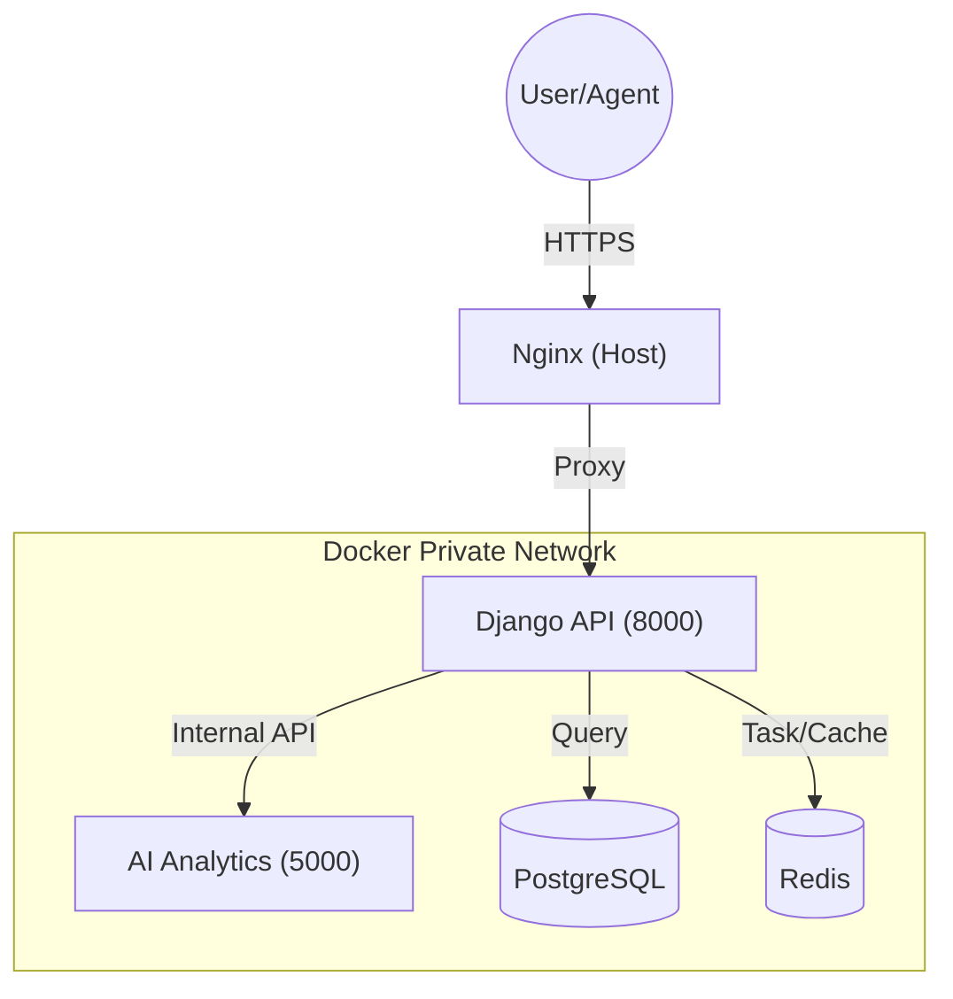

# 🏠 Scan2Home


**Automated Real Estate Inventory & Property Management Platform**

Scan2Home is a robust, multi-service platform designed to streamline property inventory management and real estate operations. By leveraging a specialized AI module alongside a powerful Django backend, it provides automated property analysis, inventory tracking, and seamless integration for real estate agencies.

---

## 🏗 Architecture Overview

The system is built with a professional **Microservices-first** approach:

- **Django Backend**: The core engine handling business logic, authentication, database management, and media processing.
- **AI Analytics Module (FastAPI)**: A dedicated, isolated service for intelligent property analysis and automated inventory generation.
- **Internal Security**: The AI module is completely isolated from the internet, reachable only by the backend through a secure Docker internal network.
- **Manual Nginx Host**: Optimized for flexible host-level proxying and SSL termination.



---

## 🚀 Key Features

- **📸 Automated Inventory**: Smart property scanning and automated data extraction.
- **🤖 AI Property Analytics**: Deep insights and analysis using our isolated FastAPI module.
- **🛡 Enterprise Security**: Hardened production settings, rotating logs, and service isolation.
- **🏗 CI/CD Ready**: Automated deployment to `api.selimreza.dev` via GitHub Actions.
- **📱 Responsive Management**: Admin dashboard for full control over properties, users, and reviews.

---

## 🛠 Tech Stack

| Layer | Technologies |
|---|---|
| **Backend** | Python, Django, DRF, Whitenoise, Gunicorn |
| **AI Module** | FastAPI, Uvicorn, OpenAI/LangChain Shell |
| **Data** | PostgreSQL 16, Redis 7 |
| **DevOps** | Docker, Docker Compose, GitHub Actions |
| **Infrastructure** | Nginx, Certbot (SSL) |

---

## 🚦 Quick Start (Development)

1. **Clone the repository**:
   ```bash
   git clone https://github.com/mohammadSelimReza/Scan2Home-Smart-Reusable-Board.git
   cd Scan2Home-Smart-Reusable-Board
   ```

2. **Setup Environment**:
   ```bash
   cp .env.example ./backend-server/.env
   cp .env.prod.example ./ai-server/.env
   ```

3. **Launch with Docker**:
   ```bash
   make up
   ```

The API will be available at `http://localhost:8000/api/v1/` and Swagger docs at `http://localhost:8000/api/schema/swagger-ui/`.

---

## 📚 API Documentation

| Environment | URL |
|---|---|
| **Production API** | [`https://scan2home.selimreza.dev/api/v1/`](https://scan2home.selimreza.dev/api/v1/) |
| **Swagger UI** | [`https://scan2home.selimreza.dev/api/schema/swagger-ui/`](https://scan2home.selimreza.dev/api/schema/swagger-ui/) |
| **Local Dev API** | `http://localhost:8000/api/v1/` |
| **Local Swagger** | `http://localhost:8000/api/schema/swagger-ui/` |

---

## 🚢 Production Deployment

For detailed production setup instructions, including VPS hardening, manual Nginx configuration, and SSL setup, please refer to our **[Deployment Guide](DEPLOYMENT.md)**.

---

## 🛠 Management CLI

This project includes a root `Makefile` for streamlined operations:
- `make up / make down`: Development lifecycle.
- `make prod-up / make prod-logs`: Production orchestration.
- `make prod-dlogs`: Real-time request monitoring.
- `make clean`: System cleanup.

---

## 🤝 Contributing

Contributions, issues, and feature requests are welcome! Feel free to check the [issues page](https://github.com/mohammadSelimReza/Scan2Home-Smart-Reusable-Board/issues).

---

## 📜 License

This project is [MIT](LICENSE) licensed.

---

<p align="center">Designed and built for excellence in Real Estate Operations.</p>
